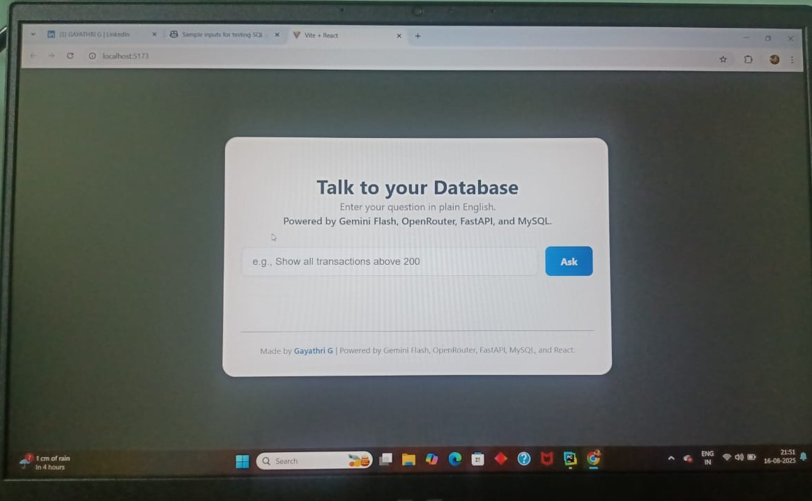
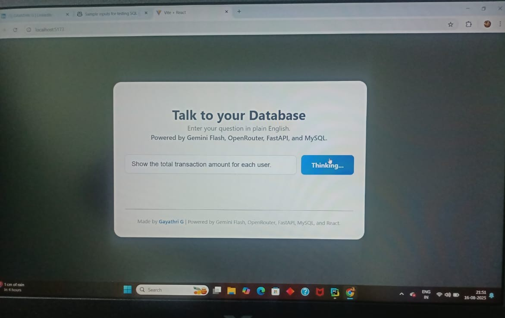
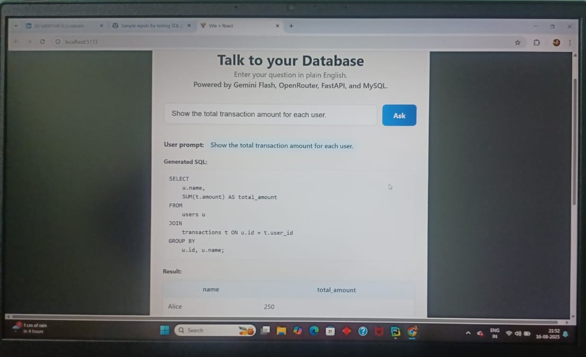
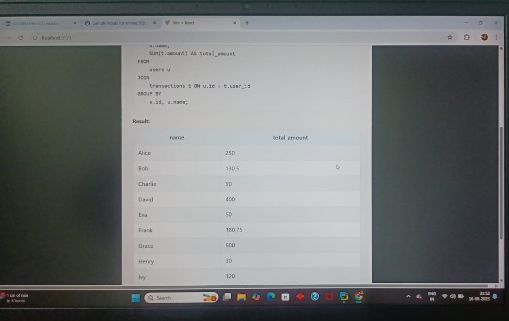
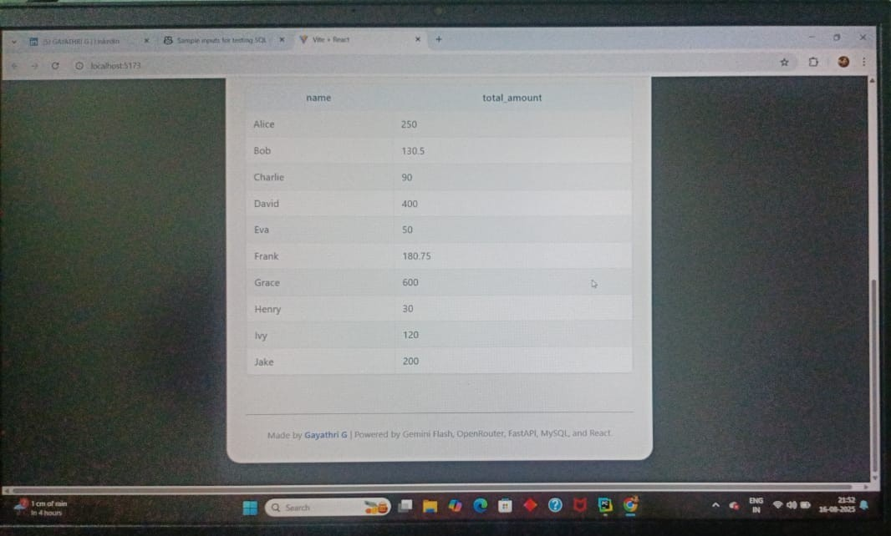

### Talk to Your Database

A web application that allows users to query a MySQL database in plain English using AI-powered natural language processing.  
Built with **React (Vite)** for the frontend, **FastAPI** for the backend, and integrates with LLM APIs (e.g., Gemini or OpenRouter) to convert plain English queries into SQL.

---

## Features

- **Natural Language to SQL**: Enter questions in English and get results from your MySQL database.
- **Modern Stack**: React (Vite) frontend, FastAPI backend, MySQL database.
- **AI Integration**: Uses LLMs (e.g. Gemini, OpenRouter) to translate user queries into SQL.
- **Easy Setup**: Works locally or can be deployed for free using Render, Vercel, and a free MySQL hosting provider.

---

## Screenshots

### Main Interface



### Example Query






---

## Getting Started

### Prerequisites

- [Node.js](https://nodejs.org/) (for frontend)
- [Python 3.8+](https://www.python.org/) (for backend)
- [MySQL database](https://www.freesqldatabase.com/) (free or local)

### 1. Clone the Repository

```bash
git clone https://github.com/GAYATHRI1006/Talk_To_Database.git
cd talktodb
```

### 2. Set Up the Backend

```bash
# Create and activate virtual environment
python -m venv venv
source venv/bin/activate  # On Windows: venv\Scripts\activate

# Install dependencies
pip install -r requirements.txt

# Create .env file in the backend directory with the following:
# (Replace with your actual credentials)
MYSQL_HOST=your_mysql_host
MYSQL_USER=your_mysql_user
MYSQL_PASSWORD=your_mysql_password
MYSQL_DATABASE=your_mysql_db
MYSQL_PORT=your_mysql_port
OPENROUTER_API_KEY=your_llm_api_key

# Start the FastAPI app
uvicorn app:app --reload
```

### 3. Set Up the Frontend

```bash
cd nl_sql_ui_app  # or your frontend folder
npm install

# Create a .env file in this directory:
VITE_API_URL=http://localhost:8000
# (or your deployed backend URL)

npm run dev
```

### 4. Open in Browser

- Frontend: http://localhost:5173
- Backend: http://localhost:8000/docs (FastAPI docs)

---

## Configuration

- **LLM API**: Obtain a free API key from [OpenRouter](https://openrouter.ai/) or [Gemini](https://ai.google.com/gemini/) and add it to your `.env` file.
- **MySQL**: Use [freesqldatabase.com](https://www.freesqldatabase.com/) (for quick free DB) or set up locally.

---

## Folder Structure

```
TalkToDB/
├── nl_sql_ui_app/    # React (Vite) frontend
├── genai/            # FastAPI backend
├── venv/             # Python virtual environment
├── .env              # Environment variables (DO NOT COMMIT)
├── README.md
└── ...
```

---

## Credits

Made by [Gayathri G](https://github.com/GAYATHRI1006)  
Powered by Gemini Flash, OpenRouter, FastAPI, MySQL, and React.

---
